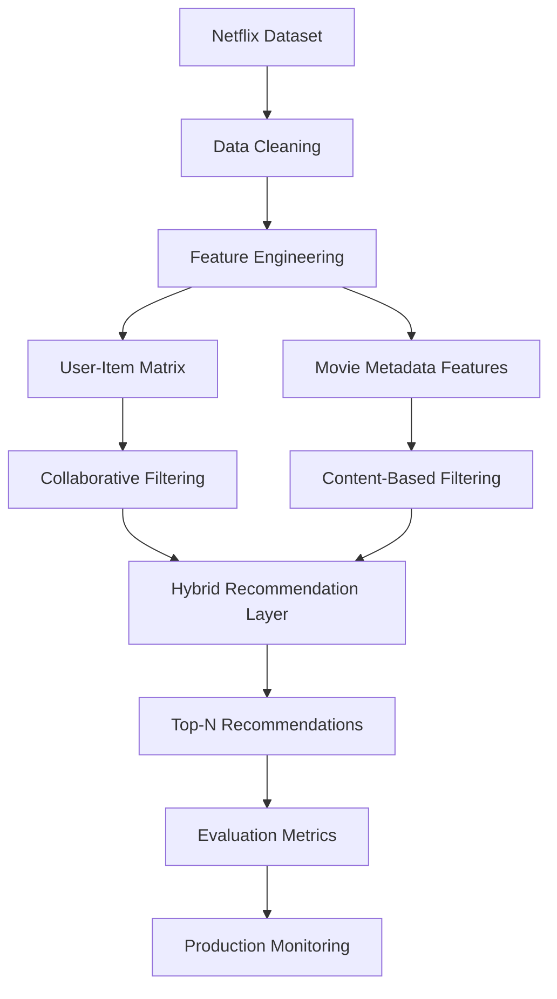

# Recommendation System Architecture

```mermaid
flowchart TD
    A[Netflix Dataset] --> B[Data Cleaning]
    B --> C[Feature Engineering]
    C --> D[User-Item Matrix]
    C --> E[Movie Metadata Features]

    D --> F[Collaborative Filtering]
    E --> G[Content-Based Filtering]

    F --> H[Hybrid Recommendation Layer]
    G --> H

    H --> I[Top-N Recommendations]
    I --> J[Evaluation Metrics]
    J --> K[Production Monitoring]
```